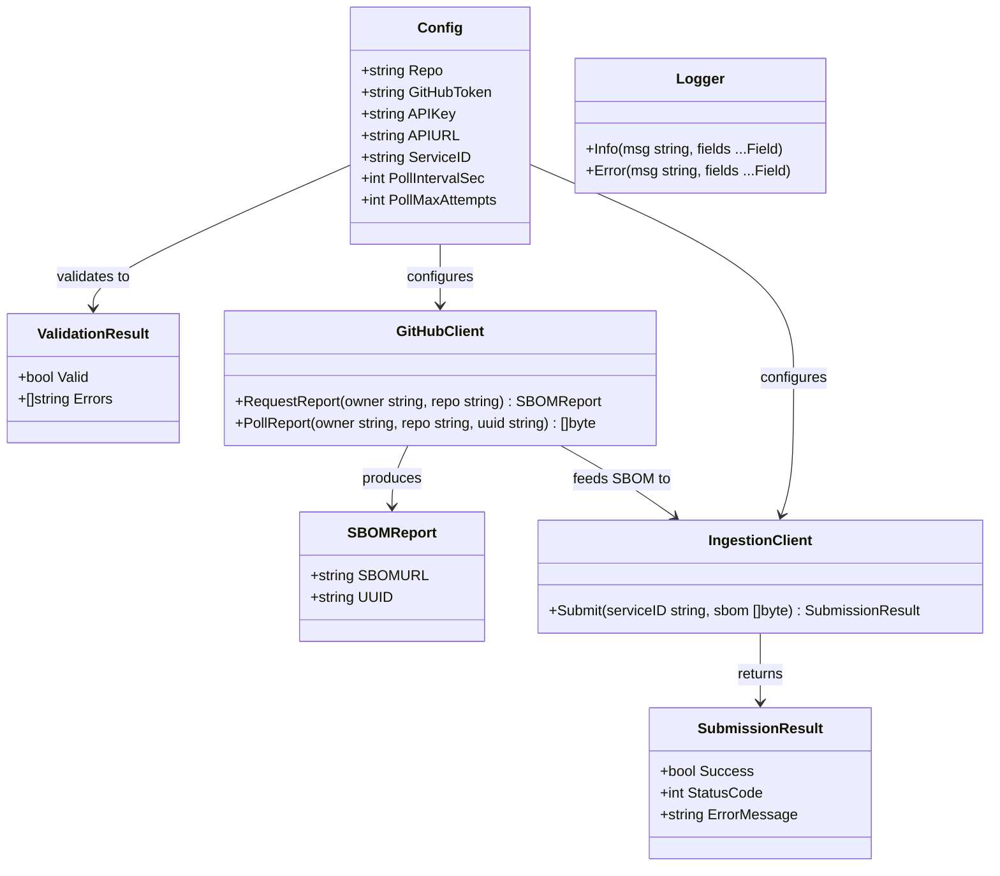

# Docker SBOM Retriever — GitHub Support with API Key Auth

## Requirements

Implement a standalone, CI-agnostic CLI tool packaged as a multi-architecture Docker image that retrieves SBOMs from GitHub's dependency graph API and submits them to the observability platform's ingestion API using API key authentication. The tool must run via `docker run` in any CI system (GitHub Actions, GitLab CI, Jenkins, CircleCI, etc.), accept configuration via environment variables and CLI flags, exit with appropriate codes for CI pipeline integration, and produce structured log output. The image must be under 50 MB compressed and published to GitHub Container Registry.

## Entities



## Approach

1. **CLI Architecture**:
   - Single-binary Go application with no CGO dependencies (enables `FROM scratch` Docker image)
   - Configuration parsed from both CLI flags and environment variables, with flags taking precedence
   - Built-in `--help` and `--version` flags for discoverability
   - Structured JSON logging to stdout for machine-parseable CI output

2. **GitHub API Integration**:
   - Direct HTTP calls to GitHub REST API (no SDK dependency) — same endpoints as existing TypeScript implementation:
     - `GET /repos/{owner}/{repo}/dependency-graph/sbom/generate-report` — initiates async SBOM generation
     - `GET /repos/{owner}/{repo}/dependency-graph/sbom/fetch-report/{uuid}` — polls for completion
   - Polling with configurable interval (default 5s) and max attempts (default 24 = 2 minutes)
   - HTTP error mapping: 403 → permissions error, 404 → dependency graph not enabled, 429 → rate limited

3. **Ingestion API Integration**:
   - POST to `{baseURL}/api/modules/sbom/services/{serviceID}` with `X-API-Key` header and `Content-Type: application/spdx+json`
   - SBOM payload passed through as-is (no transformation)
   - Response status mapped: 2xx → success, 401 → auth error, 4xx/5xx → logged with body

4. **Secret Protection**:
   - Tokens and API keys never emitted in log output
   - Error messages from upstream APIs sanitised to replace any occurrence of configured secrets with `***`
   - No environment variable dumping in debug mode

5. **Docker Strategy**:
   - Multi-stage build: Go builder stage → `FROM scratch` (or `gcr.io/distroless/static`) final stage
   - Multi-arch via Docker buildx with `--platform linux/amd64,linux/arm64`
   - Static binary with `CGO_ENABLED=0` and ldflags for version embedding
   - Final image: ~5–8 MB compressed (static Go binary + CA certificates)

6. **CI/CD for the Image Itself**:
   - GitHub Actions workflow triggered on version tags (`v*`)
   - Builds, tests, pushes to `ghcr.io/co-cddo/sbom-retriever`
   - Attests build provenance (matching existing release workflow pattern)

## Structure

### Module Layout

```
cmd/
  sbom-retriever/
    main.go              -- entrypoint, flag/env parsing, orchestration
internal/
  config/
    config.go            -- Config struct, parsing, validation
    config_test.go
  github/
    client.go            -- GitHubClient, report request, polling
    client_test.go
  ingestion/
    client.go            -- IngestionClient, submission
    client_test.go
  logger/
    logger.go            -- structured JSON logger
    logger_test.go
Dockerfile
.github/workflows/
  docker-release.yml     -- multi-arch build and push
```

### Dependencies

1. `cmd/sbom-retriever/main.go` imports `internal/config`, `internal/github`, `internal/ingestion`, `internal/logger`
2. `internal/github` depends on `internal/logger` (for poll progress messages)
3. `internal/ingestion` depends on `internal/logger` (for submission outcome)
4. `internal/config` depends on `internal/logger` (for validation errors)
5. No external Go dependencies beyond the standard library — `net/http`, `encoding/json`, `flag`, `os`, `fmt`, `time`, `strings`, `context`

### Layered Architecture

1. **CLI Layer** (`cmd/sbom-retriever/main.go`): Parse config from flags/env, validate, orchestrate the retrieve→submit flow, set exit code
2. **Config Layer** (`internal/config`): Struct definition, parsing from both flags and env vars, validation returning structured errors
3. **GitHub Client Layer** (`internal/github`): HTTP calls to GitHub API, polling logic, error mapping
4. **Ingestion Client Layer** (`internal/ingestion`): HTTP POST to ingestion API, response handling, secret sanitisation
5. **Logger Layer** (`internal/logger`): JSON-structured log output to stdout, field-based API, secret redaction

## Operations

### Create Go module and entrypoint — `cmd/sbom-retriever/main.go`

1. Responsibility: Application entrypoint — parse config, validate, orchestrate, exit
2. Methods:
   - `main()`:
     - Parse `Config` from flags and environment variables via `config.Parse(os.Args[1:], os.Environ())`
     - If parse returns errors, log each error, exit 1
     - Validate config via `config.Validate(cfg)`
     - If validation fails, log each error with field `param` indicating which parameter, exit 1
     - Create `GitHubClient` with token and logger
     - Split `cfg.Repo` into owner/repo on `/`
     - Call `githubClient.FetchSBOM(ctx, owner, repo)` — if error, log and exit 1
     - Create `IngestionClient` with base URL, API key, and logger
     - Call `ingestionClient.Submit(ctx, cfg.ServiceID, sbomBytes)` — if error, log and exit 1
     - If submission result is not success, log HTTP status and sanitised error message, exit 1
     - Log success message with repo name, exit 0
   - Context: Create `context.Background()` with signal handling (SIGTERM, SIGINT) for graceful cancellation

### Create config parser — `internal/config/config.go`

1. Responsibility: Define Config struct, parse from flags + env vars, validate
2. Attributes:
   - `Repo`: string — GitHub repository in `owner/repo` format
   - `GitHubToken`: string — GitHub personal access token
   - `APIKey`: string — Ingestion API key
   - `APIURL`: string — Ingestion API base URL
   - `ServiceID`: string — UUID identifying the target service
   - `PollInterval`: time.Duration — polling interval (default 5s)
   - `PollMaxAttempts`: int — max poll attempts (default 24)
   - `Version`: bool — print version and exit
3. Methods:
   - `Parse(args []string, environ []string) (*Config, error)`:
     - Define flag set: `--repo`, `--github-token`, `--api-key`, `--api-url`, `--service-id`, `--poll-interval`, `--poll-max-attempts`, `--version`
     - Parse flags from args
     - For each field, if flag not set, check corresponding env var: `SBOM_REPO`, `SBOM_GITHUB_TOKEN`, `SBOM_API_KEY`, `SBOM_API_URL`, `SBOM_SERVICE_ID`, `SBOM_POLL_INTERVAL`, `SBOM_POLL_MAX_ATTEMPTS`
     - Return populated Config
   - `Validate(cfg *Config) ValidationResult`:
     - Check `Repo` is non-empty and contains exactly one `/`
     - Check `GitHubToken` is non-empty
     - Check `APIKey` is non-empty
     - Check `APIURL` is a valid URL with http:// or https:// scheme
     - Check `ServiceID` matches UUID regex `^[0-9a-fA-F]{8}-[0-9a-fA-F]{4}-[0-9a-fA-F]{4}-[0-9a-fA-F]{4}-[0-9a-fA-F]{12}$`
     - Collect all errors (do not fail fast) and return `ValidationResult{Valid, Errors}`

### Create GitHub client — `internal/github/client.go`

1. Responsibility: Retrieve SBOM from GitHub dependency graph API with async polling
2. Methods:
   - `NewClient(token string, logger *logger.Logger) *Client`
   - `FetchSBOM(ctx context.Context, owner string, repo string, pollInterval time.Duration, maxAttempts int) ([]byte, error)`:
     - Call `requestReport(ctx, owner, repo)` to get `sbom_url`
     - Extract UUID from the URL (last path segment)
     - Call `pollReport(ctx, owner, repo, uuid, pollInterval, maxAttempts)` to get raw SBOM bytes
     - Return raw bytes (no JSON parsing — passthrough)
   - `requestReport(ctx context.Context, owner string, repo string) (string, error)`:
     - GET `https://api.github.com/repos/{owner}/{repo}/dependency-graph/sbom/generate-report`
     - Headers: `Authorization: Bearer {token}`, `Accept: application/json`, `X-GitHub-Api-Version: 2022-11-28`
     - On 2xx: parse JSON response, return `sbom_url` field
     - On 403: return error "Insufficient permissions — ensure token has contents:read and dependency graph is enabled"
     - On 404: return error "Dependency graph not available — enable it in repository settings"
     - On 429: return error "GitHub API rate limit exceeded — try again later"
     - On other: return error "GitHub API returned HTTP {status}"
   - `pollReport(ctx context.Context, owner string, repo string, uuid string, interval time.Duration, maxAttempts int) ([]byte, error)`:
     - Loop up to maxAttempts:
       - GET `https://api.github.com/repos/{owner}/{repo}/dependency-graph/sbom/fetch-report/{uuid}`
       - If status 200: return response body as bytes
       - If context cancelled: return context error
       - Log "SBOM report generating (attempt {n}/{max})"
       - Sleep for interval (respecting context cancellation)
     - After max attempts: return error "Timed out waiting for SBOM report after {max} attempts"

### Create ingestion client — `internal/ingestion/client.go`

1. Responsibility: Submit SBOM payload to ingestion API
2. Methods:
   - `NewClient(baseURL string, apiKey string, logger *logger.Logger) *Client`
   - `Submit(ctx context.Context, serviceID string, sbom []byte) (*SubmissionResult, error)`:
     - POST to `{baseURL}/api/modules/sbom/services/{serviceID}`
     - Headers: `X-API-Key: {apiKey}`, `Content-Type: application/spdx+json`
     - Timeout: 30 seconds
     - On 2xx: return `SubmissionResult{Success: true, StatusCode: status}`
     - On non-2xx: read body, sanitise (replace occurrences of apiKey with `***`), return `SubmissionResult{Success: false, StatusCode: status, ErrorMessage: sanitised body}`

### Create logger — `internal/logger/logger.go`

1. Responsibility: Structured JSON logging to stdout with secret redaction
2. Methods:
   - `New(secrets []string) *Logger` — creates logger with list of strings to redact
   - `Info(msg string, fields ...Field)` — emit JSON log line: `{"level":"info","msg":"...","time":"...","key":"value"}`
   - `Error(msg string, fields ...Field)` — emit JSON log line: `{"level":"error","msg":"...","time":"...","key":"value"}`
   - `redact(s string) string` — replace all occurrences of registered secrets with `***`
   - All output goes through redact before writing to stdout
3. Field type: `type Field struct { Key string; Value string }`

### Create Dockerfile

1. Responsibility: Multi-stage build producing minimal multi-arch image
2. Structure:
   - Stage 1 (`golang:1.24-alpine`): Copy source, `CGO_ENABLED=0 go build -ldflags="-s -w -X main.version=${VERSION}" -o /sbom-retriever ./cmd/sbom-retriever`
   - Stage 2 (`gcr.io/distroless/static:nonroot`): Copy binary from stage 1, copy CA certs (already in distroless/static), set entrypoint
   - ENTRYPOINT: `["/sbom-retriever"]`
   - Labels: `org.opencontainers.image.source`, `org.opencontainers.image.description`, `org.opencontainers.image.licenses`

### Create CI workflow — `.github/workflows/docker-release.yml`

1. Responsibility: Build and push multi-arch Docker image on version tags
2. Triggers: `push: tags: ["v*"]`
3. Permissions: `contents: read`, `packages: write`, `id-token: write`, `attestations: write`
4. Steps:
   - Checkout (pinned SHA, persist-credentials: false)
   - Set up Go (matching go.mod version)
   - Run tests: `go test ./...`
   - Set up Docker Buildx
   - Log in to ghcr.io: `docker/login-action` with `GITHUB_TOKEN`
   - Extract metadata (tags, labels): `docker/metadata-action`
   - Build and push: `docker/build-push-action` with `platforms: linux/amd64,linux/arm64`, `push: true`
   - Attest build provenance: `actions/attest-build-provenance`

## Norms

1. **Module structure**: All application code under `internal/` (unexported). CLI entrypoint in `cmd/sbom-retriever/`. No code in repository root.
2. **Error handling**: Return errors — never panic. Wrap with `fmt.Errorf("context: %w", err)` for stack context. Main is the only place that calls `os.Exit()`.
3. **HTTP client**: Use `net/http` from standard library. Create clients with explicit timeouts. No global default client.
4. **Testing**: Table-driven tests. Use `httptest.NewServer` for HTTP client tests. Test files co-located as `*_test.go`. 100% coverage on validation logic; integration-style tests for HTTP clients using recorded responses.
5. **Configuration**: Flags take precedence over env vars. Env var naming: `SBOM_` prefix + UPPER_SNAKE_CASE of flag name. No config files.
6. **Logging**: JSON to stdout only. No logging to stderr. Timestamp in RFC 3339 format. No colour codes. Every log line includes `level` and `msg` fields.
7. **Dependencies**: Zero external Go modules — standard library only (`net/http`, `encoding/json`, `flag`, `os`, `context`, `time`, `fmt`, `strings`, `regexp`, `io`, `testing`). No dependency management complexity.
8. **Build tags**: Use `CGO_ENABLED=0` and `-ldflags="-s -w"` for all production builds. Version injected via `-X main.version=...`.
9. **CI workflow conventions**: All action references pinned to full SHA (matching existing CI workflow pattern). Comments with version tag after SHA. `persist-credentials: false` on checkout.
10. **Go version**: Use latest stable Go (1.24+). Specified in `go.mod` and mirrored in Dockerfile and CI workflow.

## Safeguards

1. **Image size**: Compressed image must be under 50 MB. Target: <10 MB. CI workflow must include a step that fails if the image exceeds 50 MB compressed.
2. **Secret exposure**: Tokens and API keys must never appear in stdout/stderr output. Logger's redaction must cover: all Config secret fields, any upstream error message that might echo back credentials. Unit tests must assert that known secret values do not appear in log output.
3. **Exit codes**: Exit 0 only on successful submission. Exit 1 on any failure (validation, GitHub API error, ingestion API error, timeout). Exit 2 on invalid usage (bad flags). No silent failures.
4. **Timeout protection**: Container must handle SIGTERM gracefully (cancel in-progress HTTP requests within 5 seconds). Internal poll timeout defaults to 2 minutes. HTTP request timeout: 30 seconds per individual request.
5. **No external dependencies**: `go.mod` must contain zero `require` directives. This eliminates supply chain risk and ensures reproducible builds.
6. **Multi-arch**: Image must pass a smoke test on both amd64 and arm64. CI must build for both platforms — not just one with a manifest tag.
7. **Ingestion API contract**: POST body must be the raw SBOM bytes as received from GitHub — no re-serialisation or transformation. Content-Type must be `application/spdx+json`. Auth header must be `X-API-Key`.
8. **GitHub API compatibility**: The tool must set `X-GitHub-Api-Version: 2022-11-28` header on all GitHub API requests to pin to a known-stable version.
9. **Validation completeness**: All required parameters must be validated before any network call. Validation must collect all errors (not fail-fast) so users can fix all issues in one iteration.
10. **Polling resilience**: Individual poll request failures (network timeout, 5xx) should be retried within the existing poll loop rather than immediately failing the entire run. Only persistent failures (same error on 3 consecutive attempts) or explicit rejections (4xx) should abort.
